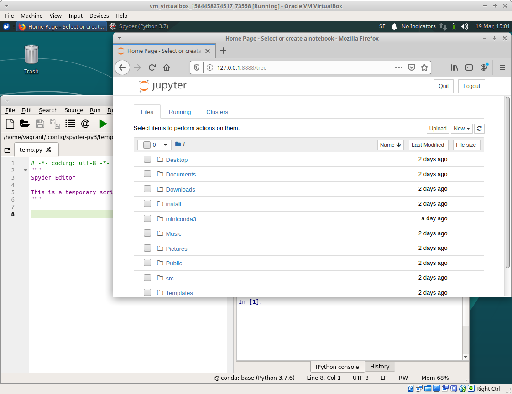

# Emergency IT kit (E-IT Kit) Virtual Machine

The Emergency IT kit (EITKit, for short) is a Virtual Machine (could be
extended to other packaging mechanisms like docker, zip files etc later) with
basic software and documentation to be able to do data collection, curation,
summarization and analysis in emergency situation.

The ideas for how it could be used are developing, but it is hoped it could be used
to support coordination centers, "dispatch centrals" and similar functions during
emergency situation, where it is crucial to be able to quickly and flexibly start
gathering data and get an overview of the situation.

Currently it packages basic python-based data science tools for data analysis,
as well as MediaWiki, and SemanticMediaWiki for data collection and curation.



Further ideas for how it could be used and extended, are welcome as issues to
the project.

## Technical overview

EITKit uses [Vagrant](https://www.vagrantup.com/) and [Ansible](https://www.ansible.com/)
to define a configuration for the virtual machine that can easily be executed using
a single command (given that you have the required dependencies installed):

## Get started

```
vagrant up
```

This will fail after a while because some user files do not exist. You will
then need to do the following to continue:

- Open VirtualBox
- Right-click on the (now running) virtual machine
- Select "Show"
- Log in to Xubuntu with vagrant and vagrant.
- Then go back to the shell where you were running `vagrant up`, and now run `vagrant provision`.

After this step is finished, the virtual machine should be ready to use.

## Required dependencies

To build the virtual machine in this recipe, you need the following software installed:

- VirtualBox
- Vagrant
- Ansible

On Ubuntu 18.04 you can install them with:

```bash
sudo apt -y install virtualbox virtualbox-guest-utils vagrant ansible
```

## Usage

The login to the vm is vagrant:vagrant

## Troubleshooting

If you run Windows 10 on your host machine, and get a message such as "VT-X
missing" when trying to start the virtual machine, you can try the following:

- Start PowerShell as administrator (Search for it in the start menu, and right
  click and choose "Run as Administrator" or "Kör som administratör")
- In PowerShell, run the command: `bcdedit /set hypervisorlaunchtype off`
- Restart the computer

If this still does not help, you can also try:

- Open the control panel (Search for "control panel" in the start menu)
- Choose "Programs and features"
- Choose "Add or remove features in Windows"
- Disable "Hyper-V"

## Acknowledgements

The development of this project is sponsored by:

- [Savantic AB](https://savantic.eu/)
- [RIL Partner AB](https://rilpartner.com/)
